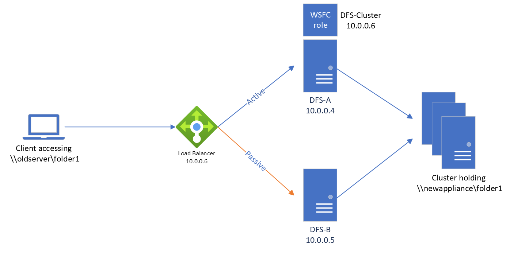

# Implementing DFS-N cluster in Azure

While migrating your file system to Azure, you may require maintaining UNC paths. That will require DFS-N root consolidation and the following example below can guide you. Also, more info can be found at [Deploy a DFS Namespaces failover cluster](https://learn.microsoft.com/azure/architecture/solution-ideas/articles/dfs-failover-cluster-vms).



## Guide

1. In a test environment, set up two servers with DFS-N roles and create in each of them the namespace Stand-alone **\\\DFS-A\#oldserver** and **\\\DFS-B\#oldserver** with both targeting folders pointing to **\\\newapplicance\folder1**. Keeping the old UNC paths can make it complex depending on the amount of shares.

   Some additional guidelines can be found in [Use DFS-N and DFS Root Consolidation with Azure NetApp Files](https://learn.microsoft.com/azure/azure-netapp-files/use-dfs-n-and-dfs-root-consolidation-with-azure-netapp-files)

1. Make sure you have a DNS entry for the root target.

1. Test if both servers can be used to connect to the target folders individually using the \\\oldserver alias. The next step will provide cluster details.

1. Set up the Windows Failover Cluster. You can follow the guide at [Deploying DFS Replication on a Windows Failover Cluster](https://techcommunity.microsoft.com/t5/storage-at-microsoft/deploying-dfs-replication-on-a-windows-failover-cluster-amp-8211/ba-p/423913), if needed.

   At the end of this step, you will have three main components:

   - DFS-A -> This is the node A of your cluster (E.g. hostname DFS-server-A.contoso.com, IP 10.0.0.4)
   - DFS-B -> This is the node B of your cluster (E.g. hostname DFS-server-B.contoso.com, IP 10.0.0.5)
   - Cluster -> This is the cluster service (E.g. hostname DFS-Cluster.contoso.com, IP 10.0.0.6)<br>

1. Run the powershell command in one of your DFS nodes `Get-ClusterResource $IPResourceName | Get-ClusterParameter` to make sure you have the cluster up and running.

   Now the cluster must be ready to listen on port `59999`. This step is needed for setting up the Load Balancer probe, so that it redirects traffic only to the active node. Execute the following PowerShell script:

   ```powershell
   $ClusterNetworkName = "<MyClusterNetworkName>" # The cluster network name. Use Get-ClusterNetwork on Windows Server 2012 or later to find the name.
   $IPResourceName = "<IPResourceName>" # The IP address resource name.
   $ListenerILBIP = "<n.n.n.n>" # The IP address of the internal load balancer. This is the static IP address for the load balancer that you configured in the Azure portal.
   [int]$ListenerProbePort = <nnnnn>

   Import-Module FailoverClusters
   Get-ClusterResource $IPResourceName | Set-ClusterParameter -Multiple @{"Address"="$ListenerILBIP";"ProbePort"=$ListenerProbePort;"SubnetMask"="255.255.255.255";"Network"="$ClusterNetworkName";"EnableDhcp"=0}
   ```

   More information about the above script can be found at [Configure a load balancer & availability group listener](https://learn.microsoft.com/azure/azure-sql/virtual-machines/windows/availability-group-load-balancer-portal-configure?view=azuresql)

1. Setup the Azure Load Balancer (Standard sku recommended).

   - The FrontEnd IP should be static and have the same IP as the cluster. (E.g. 10.0.0.6)
   - The Backend pool should have the two nodes. (E.g. DFS-A and DFS-B)
   - The Probe should check port `59999`.
   - The rule should tied all of them together and have enabled Floating IP.

1. Perform the final test

   Your Load Balancer should be probing successfully the Active DFS node. The passive will fail. Go ahead and failover your cluster to the other node. The Load Balancer should identify that, as you can see in its metrics.

## Clean up

Be sure to delete any resources that you created for testing to ensure you do not have unncessary cost in your pre-production environment.
